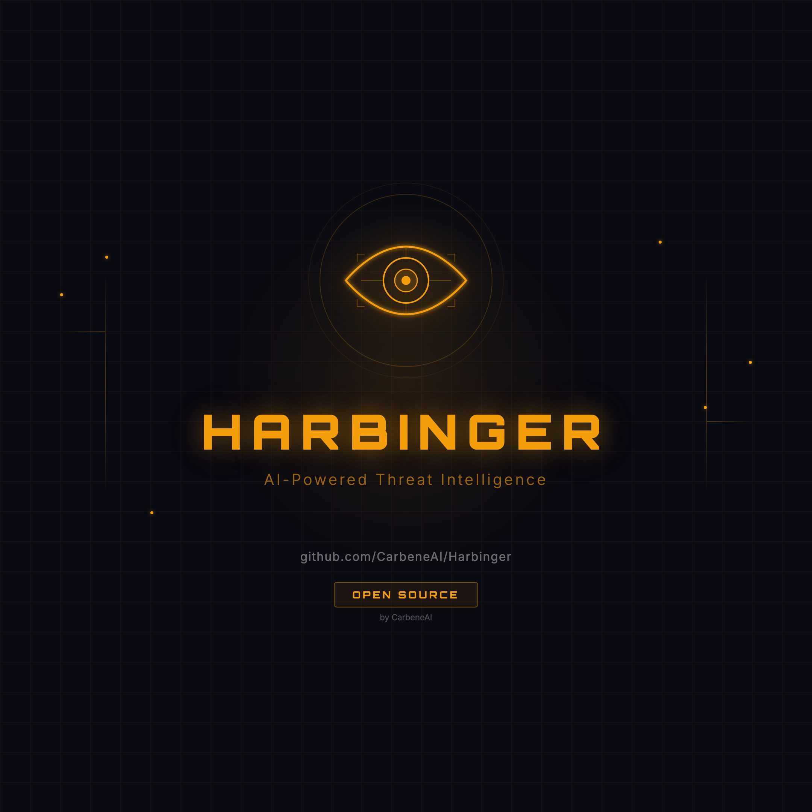
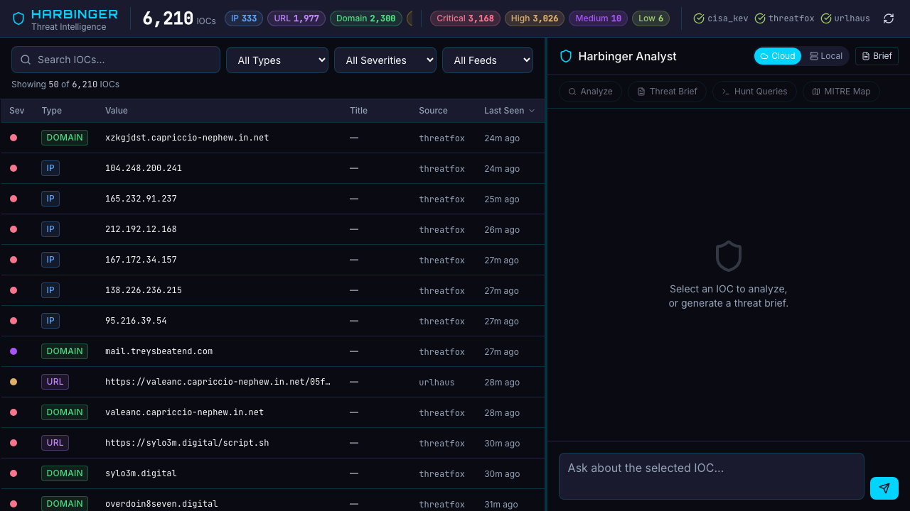
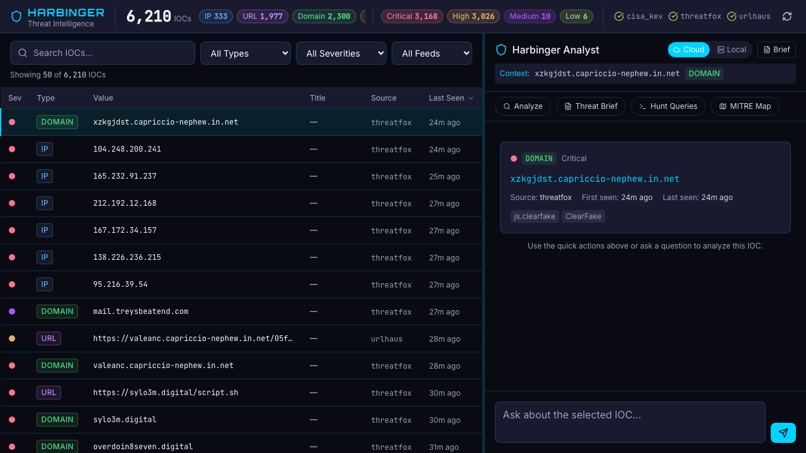
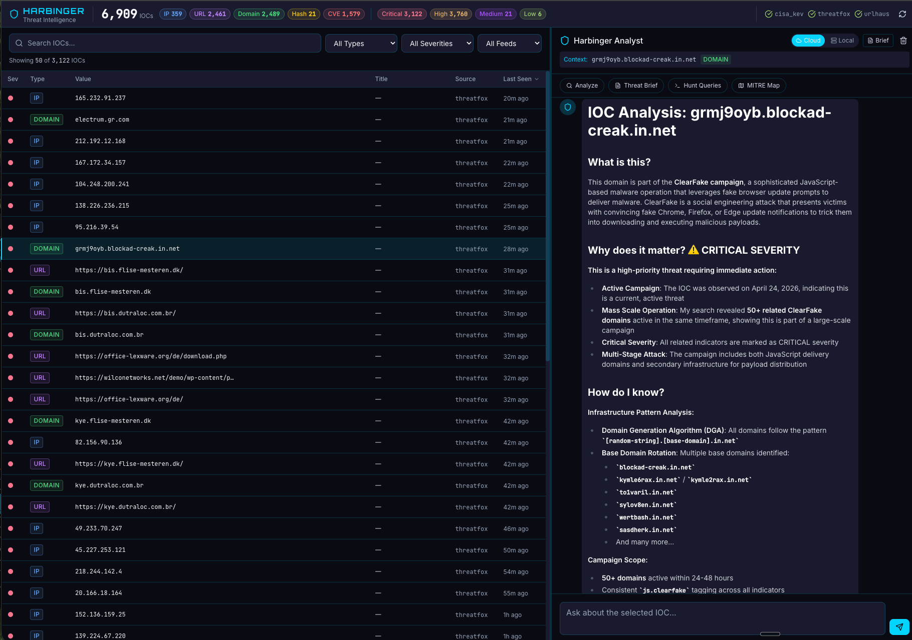
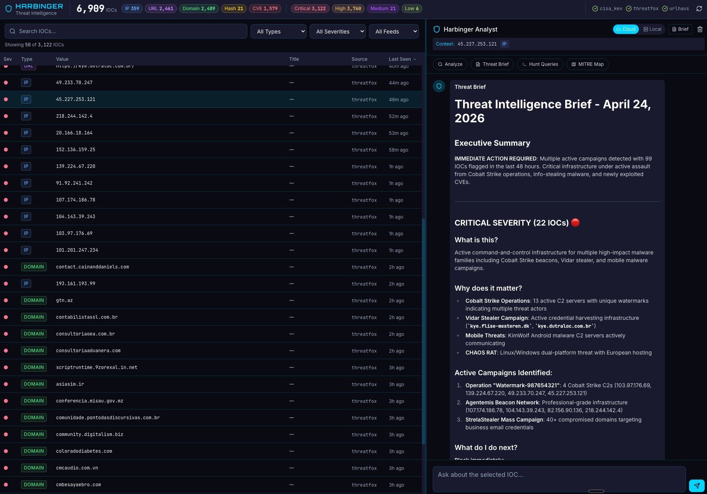

<p align="center">
  
</p>

# Harbinger

**AI-Powered Threat Intelligence Platform**

[](LICENSE)
[](https://bun.sh)
[](https://vuejs.org)

Harbinger is an open-source threat intelligence platform that ingests free public IOC feeds, stores them locally in SQLite, and surfaces them through an AI-powered analyst interface. Ask questions about threats in plain English. Keep your data on your network.

Part of CarbeneAI's open-source security suite alongside [Specter](https://github.com/CarbeneAI/Specter) (SIEM dashboard) and [Talon](https://github.com/CarbeneAI/Talon) (penetration testing).

## Features

- **Three Free Threat Feeds** — CISA Known Exploited Vulnerabilities, Abuse.ch URLhaus, and Abuse.ch ThreatFox. No paid subscriptions required.
- **AI Threat Analyst** — Ask questions about IOCs in plain English. The AI searches your local database, correlates indicators, and explains threats with actionable remediation steps.
- **Threat-Intel Enrichment** *(optional)* — On-demand IOC enrichment via the audited [cve-mcp](https://github.com/mukul975/cve-mcp-server) Python server: NVD details, EPSS exploit-probability scores, direct CISA KEV checks, MITRE ATT&CK mapping, AbuseIPDB + GreyNoise IP reputation, Shodan host intel, VirusTotal hash lookups, URLScan reputation, and crt.sh certificate transparency for domains. The AI calls these tools selectively — most analyses still run on local data alone.
- **Auto-Defanged Output** — All AI responses (chat, analyses, threat briefs) automatically defang URLs, hostnames, and IPs using the standard IOC-sharing convention (`http://` → `hxxp://`, `evil.com` → `evil[.]com`, `1.2.3.4` → `1[.]2[.]3[.]4`). Paste briefs into Microsoft Teams, Slack, or email without getting blocked as malicious links. URL paths and CVE IDs are preserved.
- **Cloud/Local AI Toggle** — Switch between Anthropic Claude (cloud) and Ollama (local) with one click. Sensitive threat data stays on your network.
- **Analyst Guidance Mode** — AI responses follow a structured triage format: What is this? Why does it matter? How do I know? What do I do next? What should I watch for?
- **IOC Detail Cards** — Click any IOC to see full context: severity, type, description, source, timestamps, tags, and reference links.
- **Threat Brief Generation** — One-click AI-generated threat briefs summarizing the most critical recent intelligence.
- **Hunt Query Generation** — Generate Sigma rules, KQL, and SPL queries for any IOC.
- **MITRE ATT&CK + D3FEND Mapping** — Map IOCs to attack techniques and defensive countermeasures.
- **Full-Text Search** — Search across IOC values, titles, descriptions, and tags with SQLite FTS5.
- **Markdown Rendering** — AI responses render with headers, code blocks, lists, and tables via marked.js.
- **Zero-Config Storage** — SQLite database with no external dependencies. No Postgres, no Redis.

## Screenshots

### Dashboard Overview
IOC table with severity color coding, type badges, search, and filters. AI analyst panel on the right.



### IOC Detail Card
Click any IOC to see full context before asking the AI to analyze it.



### AI Analysis
Structured threat analysis with campaign attribution, severity assessment, and infrastructure pattern detection.



### Threat Brief
One-click AI-generated intelligence brief summarizing critical threats, active campaigns, and recommended actions.



## Tech Stack

| Component | Technology |
|-----------|-----------|
| Runtime | Bun |
| Frontend | Vue 3 + Vite + Tailwind CSS |
| Backend | Bun HTTP server |
| Database | SQLite (bun:sqlite) with FTS5 |
| AI | Anthropic Claude API (tool use) or Ollama (local) |
| Theme | CarbeneAI dark (Tokyo Night) |
| Icons | Lucide Vue |

## Requirements

- [Bun](https://bun.sh) v1.0+
- [Abuse.ch Auth Key](https://auth.abuse.ch/) (free — for URLhaus + ThreatFox feeds)
- [Anthropic API key](https://console.anthropic.com) (for cloud AI) **or** [Ollama](https://ollama.com) (for local AI)
- *Optional:* [cve-mcp](https://github.com/mukul975/cve-mcp-server) — adds threat-intel enrichment tools (see [Threat-Intel Enrichment](#threat-intel-enrichment))

## Quick Start

### 1. Clone the repository

```bash
git clone https://github.com/CarbeneAI/Harbinger.git
cd Harbinger
```

### 2. Configure environment

```bash
cp .env.example .env
```

Edit `.env` and set:

```bash
# Required for URLhaus + ThreatFox feeds (register free at https://auth.abuse.ch/)
ABUSE_CH_AUTH_KEY=your-key-here

# Required for Cloud AI mode (or use Ollama for local AI)
ANTHROPIC_API_KEY=sk-ant-...
```

### 3. Install dependencies

```bash
cd apps/server && bun install
cd ../client && bun install
cd ../..
```

### 4. Start Harbinger

```bash
./manage.sh start
```

Open http://localhost:5174

Feeds begin polling immediately. CISA KEV loads ~1,500 CVEs, URLhaus adds malicious URLs, and ThreatFox adds IOCs with malware attribution. First poll completes in under 15 seconds.

## Configuration

| Variable | Default | Description |
|----------|---------|-------------|
| `ABUSE_CH_AUTH_KEY` | — | Abuse.ch API key (free, required for URLhaus + ThreatFox) |
| `ANTHROPIC_API_KEY` | — | Anthropic API key (required for cloud AI mode) |
| `POLL_INTERVAL_MS` | `3600000` | Feed poll interval in ms (default: 1 hour) |
| `DB_PATH` | `./harbinger.db` | SQLite database file path |
| `PORT` | `4001` | Server port |
| `CVE_MCP_ENABLED` | `true` | Enable cve-mcp threat-intel enrichment tools (set `false` to disable) |
| `CVE_MCP_PYTHON` | `~/Dev/cve-mcp-server/.venv/bin/python` | Path to the cve-mcp Python interpreter |
| `CVE_MCP_CWD` | `~/Dev/cve-mcp-server` | Path to the cve-mcp install directory |

## How AI Analysis Works

When you select an IOC and use the chat panel:

1. The selected IOC is shown as a detail card with full context
2. The AI can call `search_iocs` to query your local SQLite database
3. If cve-mcp enrichment is enabled, the AI can also call third-party intel tools (see [Threat-Intel Enrichment](#threat-intel-enrichment) below)
4. Up to 5 tool call iterations for deep correlation
5. Quick actions: Analyze, Threat Brief, Hunt Queries, MITRE ATT&CK/D3FEND mapping

### Cloud vs Local AI

| | Cloud (Anthropic) | Local (Ollama) |
|---|---|---|
| **Model** | Claude Sonnet | Any Ollama model |
| **Data privacy** | Sent to Anthropic API | Stays on your network |
| **IOC search** | Autonomous tool use | Not available |
| **cve-mcp enrichment** | Autonomous tool use | Not available |
| **Speed** | Fast | Depends on hardware |
| **Cost** | API usage fees | Free |

## Threat Intelligence Feeds

| Feed | Type | IOCs | Update Frequency |
|------|------|------|-----------------|
| [CISA KEV](https://www.cisa.gov/known-exploited-vulnerabilities-catalog) | Known Exploited CVEs | ~1,500+ | Daily |
| [URLhaus](https://urlhaus.abuse.ch/) | Malicious URLs + Domains | ~1,000+ | Hourly |
| [ThreatFox](https://threatfox.abuse.ch/) | IOCs with malware attribution | ~3,500+ | Weekly (7-day window) |

All feeds are free. CISA KEV requires no authentication. URLhaus and ThreatFox require a free API key from [auth.abuse.ch](https://auth.abuse.ch/).

## Auto-Defanged Output

Threat intelligence often involves real malicious URLs and IPs. When you paste an AI analysis or threat brief into Microsoft Teams, Slack, or email, those clients flag live malicious links and either block the message or rewrite it. Harbinger automatically defangs all AI output using the industry-standard IOC-sharing convention before returning it.

### What gets defanged

| Pattern | Before | After |
|---|---|---|
| URL scheme | `http://` | `hxxp://` |
| URL scheme | `https://` | `hxxps://` |
| URL scheme | `ftp://` | `fxp://` |
| Hostname dots | `https://evil.example.com/path` | `hxxps://evil[.]example[.]com/path` |
| IPv4 addresses | `192.168.1.1` | `192[.]168[.]1[.]1` |

### What is preserved

- URL paths, query strings, and fragments (`/api/v1/foo?id=1#bar` is unchanged)
- CVE IDs (`CVE-2021-44228` is unchanged)
- File extensions inside paths (`.html`, `.exe` inside the path stay literal)
- Plain prose with no URLs/IPs

### Where it applies

Defanging is applied to all three AI-output paths:

1. **Chat responses** (Cloud/Anthropic and Local/Ollama)
2. **Threat briefs** (the one-click brief generator)
3. **All quick actions** (Analyze, Threat Brief, Hunt Queries, MITRE ATT&CK/D3FEND)

Two layers of defense: (1) the system prompt instructs the AI to emit defanged form natively, and (2) a deterministic post-processor runs over the response before returning. The post-processor is idempotent — pre-defanged input passes through unchanged.

If you need raw (non-defanged) URLs for a specific use case (e.g. piping into automated scanning), open an issue — we'll add an opt-out flag.

## Threat-Intel Enrichment

Optional integration with the audited [cve-mcp](https://github.com/mukul975/cve-mcp-server) Python server adds 9 on-demand enrichment tools to the AI analyst (Cloud/Anthropic mode only). Tools are called selectively by the AI when the IOC context warrants deeper investigation.

| IOC type | Enrichment tools | Source(s) |
|---|---|---|
| **CVE** | `lookup_cve` | NVD (CVSS, description, references) |
| **CVE** | `get_epss_score` | FIRST.org EPSS exploit-probability |
| **CVE** | `check_kev` | Direct CISA KEV catalog lookup |
| **CVE** | `get_attack_mapping` | MITRE ATT&CK technique mapping |
| **IP** | `check_ip_reputation` | AbuseIPDB + GreyNoise (combined) |
| **IP** | `shodan_host_lookup` | Shodan (open ports, services, banners) |
| **Domain** | `get_domain_intel` | crt.sh certificate transparency + subdomains |
| **URL** | `check_url_safety` | URLScan.io |
| **Hash** | `lookup_file_hash` | VirusTotal |

### Setup

1. Install cve-mcp following its [setup guide](https://github.com/mukul975/cve-mcp-server) (target `~/Dev/cve-mcp-server`)
2. Configure cve-mcp's own `.env` with your API keys (NVD, AbuseIPDB, VirusTotal, Shodan, GreyNoise — all have free tiers)
3. Set `CVE_MCP_ENABLED=true` in Harbinger's `.env` (default)
4. Override `CVE_MCP_PYTHON` and `CVE_MCP_CWD` if cve-mcp lives outside `~/Dev/cve-mcp-server`
5. Restart Harbinger — the AI analyst will see the new tools automatically

### Privacy Note

Enrichment tools forward IOC values (IPs, domains, URLs, hashes, CVE IDs) to third-party APIs. Don't enrich internal/confidential indicators — the third party sees them. The AI is instructed to enrich only when the context warrants it; you can fully disable with `CVE_MCP_ENABLED=false`.

## API Reference

| Method | Endpoint | Description |
|--------|----------|-------------|
| GET | `/health` | Health check with IOC count |
| GET | `/stats` | IOC counts by type, severity, feed |
| GET | `/feeds` | Feed status and last poll times |
| POST | `/feeds/poll` | Trigger immediate feed poll |
| GET | `/iocs?search=&type=&severity=&feed=&limit=&offset=` | Query IOCs with filters |
| GET | `/iocs/:id` | Get single IOC by ID |
| POST | `/iocs/search` | Full-text search IOCs |
| POST | `/chat` | AI chat message with IOC context |
| GET | `/chat/prompts` | Quick prompt templates |
| POST | `/briefs/generate` | Generate AI threat brief |
| GET | `/briefs` | List generated briefs |
| GET | `/settings/ollama-models` | List available Ollama models |

## Manage Script

```bash
./manage.sh start    # Start server + client
./manage.sh stop     # Stop all processes
./manage.sh restart  # Restart
./manage.sh status   # Check if running
./manage.sh logs     # View recent logs
```

## Roadmap

- **Wazuh/Specter Integration** — Bidirectional enrichment between Harbinger and Specter. When Specter sees an alert, Harbinger provides threat context automatically.
- **PDF Report Ingestion** — Ingest threat reports, extract IOCs and TTPs via AI.
- **Custom Feed Support** — Add your own STIX/TAXII or CSV feeds.
- **CVE Inventory Alerting** — Track an inventory of products/versions and alert when new CVEs match.
- **STIX2 Export** — Export IOCs as STIX2 bundles for sharing.

## Part of CarbeneAI's Security Suite

| Tool | Purpose | Link |
|------|---------|------|
| **Talon** | AI-Assisted Penetration Testing | [GitHub](https://github.com/CarbeneAI/Talon) |
| **Specter** | Real-Time SIEM Dashboard | [GitHub](https://github.com/CarbeneAI/Specter) |
| **Harbinger** | AI-Powered Threat Intelligence | You are here |

## Contributing

Pull requests welcome. Please open an issue first to discuss major changes.

## License

MIT — see [LICENSE](LICENSE)

---

Built by [CarbeneAI](https://carbene.ai)
